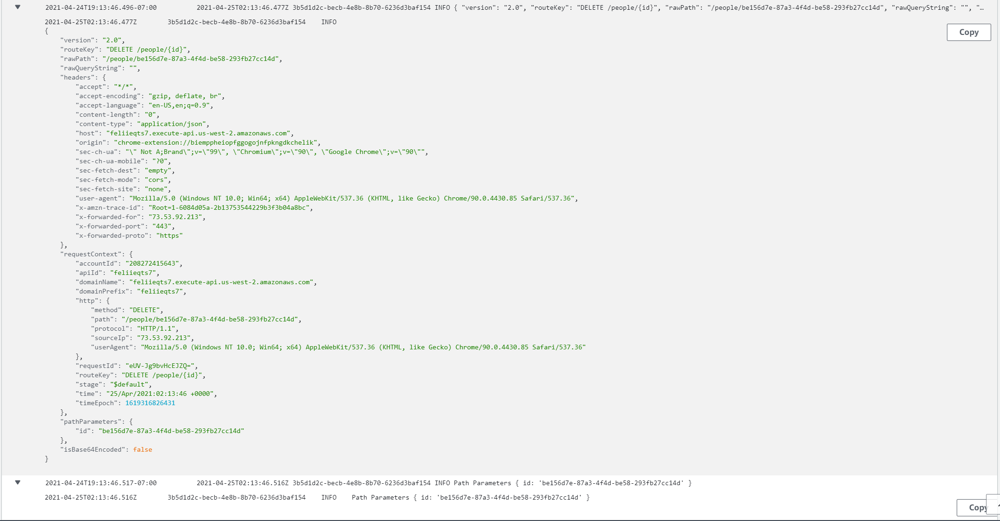

# Lambda Update

Lambda function uploaded on AWS, that deletes person model from DynamoDB on AWS.

API base URL: https://feliieqts7.execute-api.us-west-2.amazonaws.com/people/

##Endpoints

- DELETE /people/{id} - deletes existing person from DB.

## Tests

